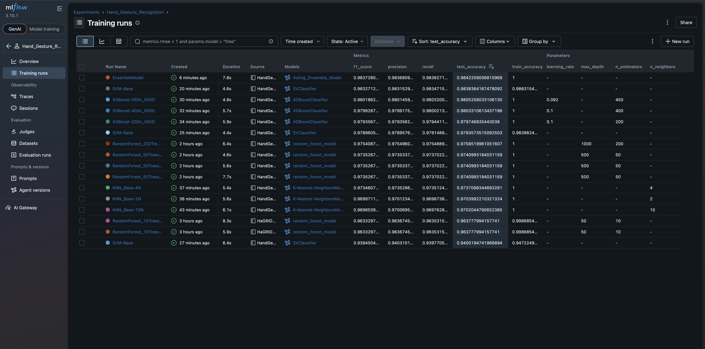
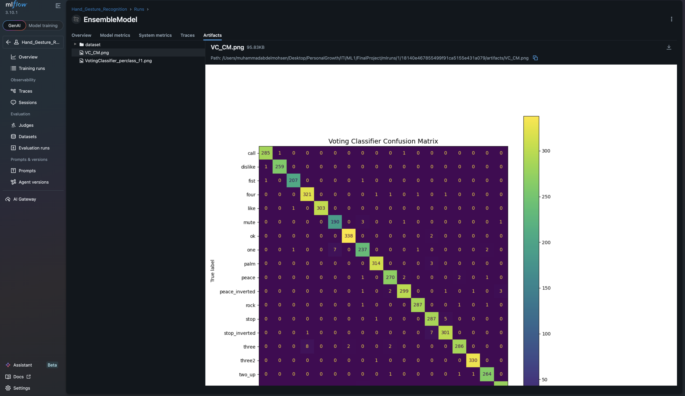
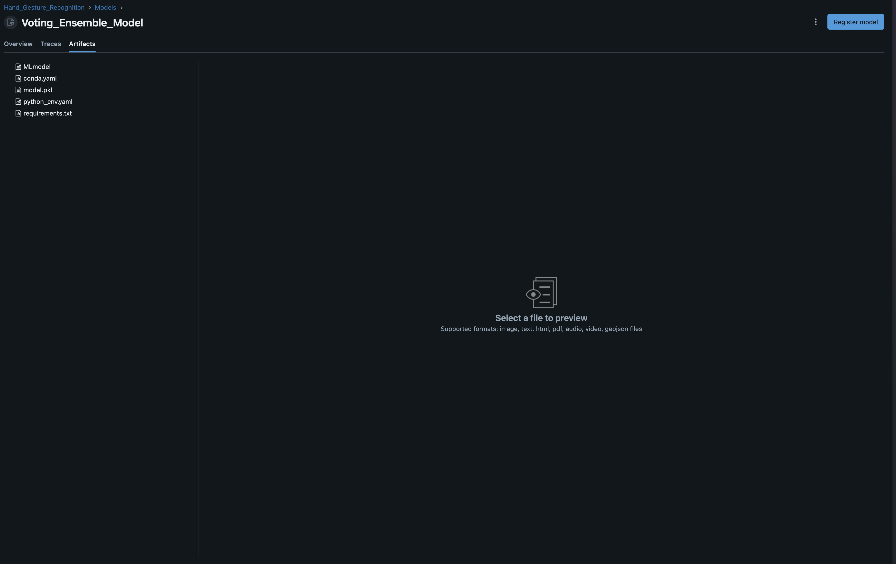
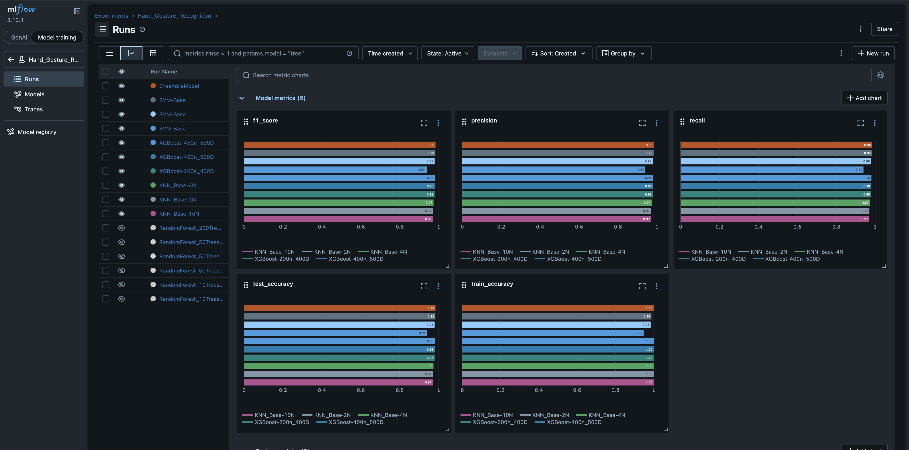
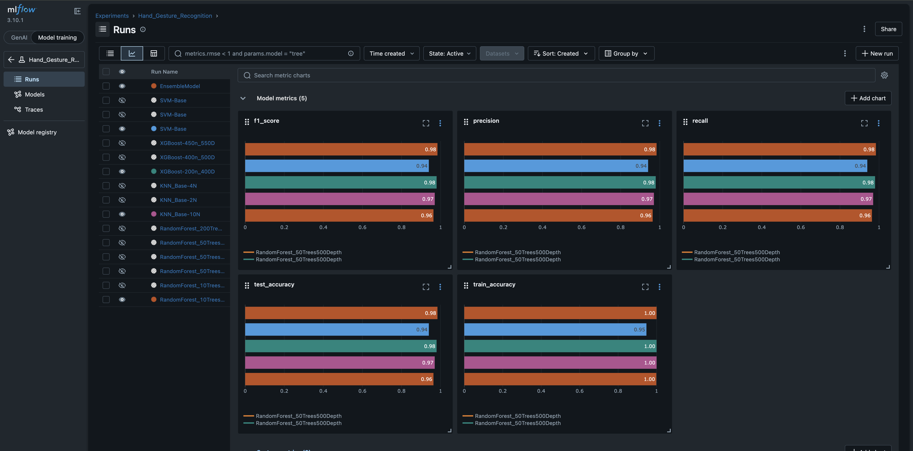
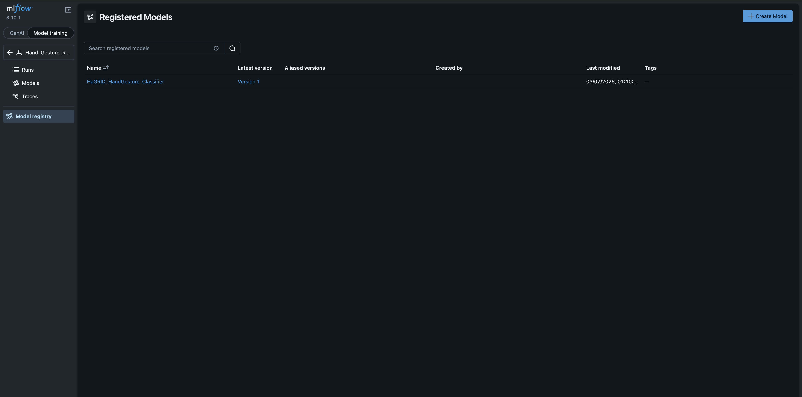
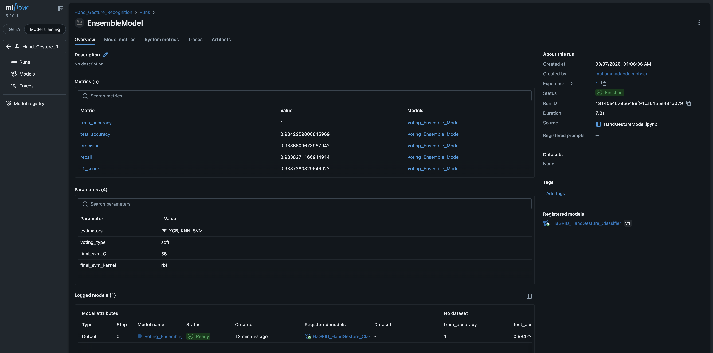
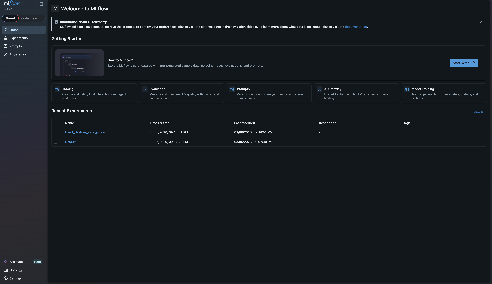

# Hand Gesture Recognition Model — ML1 + MLflow Tracking

> **Project Type:** Supervised Machine Learning Classification  
> **Dataset:** HaGRID Hand Gesture Landmarks (MediaPipe 21 landmarks, 3D)  
> **Tracking:** MLflow (runs, metrics, artifacts, model registry)  

---

## 1) Project Overview

This project performs **hand gesture classification** using **MediaPipe hand landmarks** extracted from the **HaGRID dataset**.  
Each sample contains **21 landmarks** with **(x, y, z)** coordinates → **63 numerical features**, and a **gesture label** as the target.

The workflow includes:
- Loading and exploring the landmark dataset
- Normalizing landmarks for scale and translation invariance
- Training multiple ML models (Random Forest, KNN, XGBoost, SVM, Ensemble-Voting)
- Tracking each experiment run using **MLflow**
- Comparing models using MLflow charts and selecting the best model
- Registering the best model in the **MLflow Model Registry**


## 2) Dataset

- **Input:** `Dataset/hand_landmarks_data.csv`
- **Features:** 63 values → 21 landmarks × (x, y, z)
- **Target:** `label` (gesture class)

**Shape summary:**
- 63 feature columns
- 1 label column → total 64 columns

### Data Balance
The dataset is generally balanced, with minor under-sampling for:
- `fist`
- `mute`

---

## 3) Preprocessing & Normalization

To make the model robust across different hand sizes and positions, landmarks were normalized per sample:

### Normalization steps
1. **Translation normalization:** subtract wrist landmark (landmark 0) from all landmarks  
2. **Scale normalization:** divide by hand size (norm of landmark 12) to normalize scale

This provides:
- position invariance
- scale invariance

---

## 4) Models Trained

The following models were trained and evaluated:

- **Random Forest**
- **KNN**
- **XGBoost**
- **SVM (RBF)**
- **Voting Classifier (Soft Voting)** — Ensemble of RF + XGB + KNN + SVM

Each model was evaluated using:
- Train Accuracy
- Test Accuracy
- Precision (macro)
- Recall (macro)
- F1-score (macro)
- Confusion Matrix
---

## 5) MLflow Experiment Tracking

### Experiment Name
- **Experiment:** `Hand_Gesture_Recognition`

### MLflow Helper Script
All MLflow functionality is placed in a dedicated script:
- `mlflowFuncs.py`

This script contains the following helper methods:
- `startMlflowExperiment(name)`
- `log_experiment(run_name, model, params, metrics, artifacts, model_name)`
- `get_best_run(experiment_name, metric=...)`
- `register_best_model(run_id, model_name, registered_name)`

---

## 6) Run Naming Convention (Representative Names)

Runs were logged with representative names describing the model and its settings, for example:
- `RandomForest_200Trees1000Depth`
- `KNN_Base-4N`
- `XGBoost-450n_550D`
- `SVM-Base`
- `EnsembleModel`




---

## 7) Logged Artifacts (Per Run)

Each run logs artifacts such as:
- Confusion matrix image
- Per-class F1 plot image

Artifacts are stored in MLflow under each run.

Here is an example of the artifacts view for a run that i logged manually:


#### and here is the default artifacts that was logged along with the model itself (MLmodel, conda.yaml, model.pkl):


---

## 8) Model Comparison & Decision

### MLflow Comparison
Models were compared using MLflow’s metrics and charts to determine the best candidate for deployment.

**Primary metric for selection:** `test_accuracy`  
Additional supporting metrics:
- macro F1-score
- per-class behavior (especially for confusing gestures)
- confusion matrix quality





### Local Comparison Plot (Notebook)
A final comparison plot was also produced locally in the notebook to visualize accuracy and F1 across models.


#### Model Performance Summary (Test Set)

| Model | Train Accuracy | Test Accuracy | Precision | Recall  | F1-score  |
|------|---------------:|--------------:|--------------:|------------:|-------------:|
| Random Forest | 100.00% | 97.59% | 97.55% | 97.55% | 97.54% |
| KNN (n=4, distance) | 100.00% | 97.37% | 97.35% | 97.35% | 97.35% |
| XGBoost | 100.00% | 98.05% | 98.01% | 98.03% | 98.02% |
| SVM (RBF) | 98.83% | 98.38% | 98.32% | 98.35% | 98.33% |
| Voting (Soft) | **100.00%** | **98.42%** | **98.37%** | **98.38%** | **98.37%** |

---

## 9) Best Model & Registry

### Best Model (Selected)
The best run was selected using:
- `get_best_run("Hand_Gesture_Recognition", metric="test_accuracy")`

Then registered to MLflow Model Registry as:

- **Registered Model Name:** `HaGRID_HandGesture_Classifier`
- **Model Artifact Name:** `Voting_Ensemble_Model`

### Model Registry & Versions
The selected model was placed into the registry and versioned.


#### Registered Model Page Showing Versions & Metrics



---


## 10) Repository Structure

```

.
├── Dataset
│   ├── hand_landmarks_data.csv
├── HandGestureModel.ipynb
├── mlflowFuncs.py                # (research branch only)
├── assets/
│   ├── RandomForest/
│   ├── KNN/
│   ├── XGBoost/
│   ├── SVM/
│   └── VotingClassifier/
├── mlruns/                       # (research branch only)
├── screenshots/                  # (research branch only)
└── README.md

````

> **screenshots/** folder contains MLflow UI screenshots:
- run list
- metrics comparisons
- artifacts view
- registered model page
- model version page

---

## 11) How to Run

### A) Install Dependencies
Create and activate a virtual environment, then install:

```bash
pip install -r requirements.txt
````

### B) Launch Notebook

```bash
jupyter notebook
```

### C) Run MLflow UI

If using local MLflow tracking:

```bash
mlflow ui
```

Then open:

* `http://127.0.0.1:5000`

and this page will appear showing the main mlflow dashboard:


---